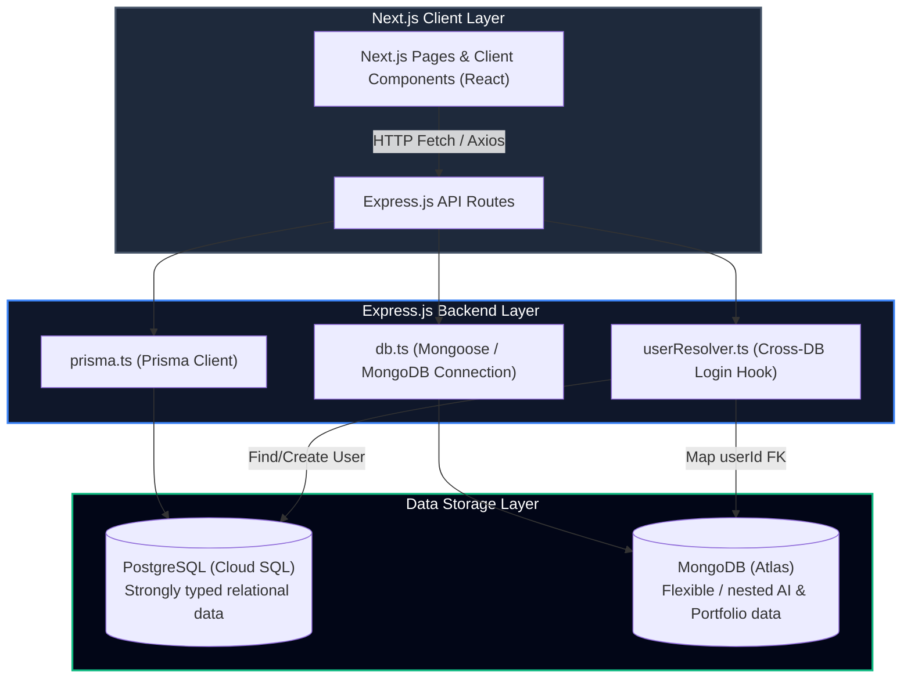

# 🔗 TN-Schools Data Connection Architecture

This document provides a comprehensive overview of how backend data is connected, flows, and is synchronized across the **TN-Schools AI Ecosystem**.

---

## 📐 High-Level Architecture Flow

The TN-Schools application follows a multi-tier architecture where the frontend client interfaces with a central backend API, which dynamically routes data requests to PostgreSQL and MongoDB databases.



---

## 🛠️ Key Connection Components

Below are the primary files governing the data connections within the codebase:

| Component / Layer | Local File Path | Purpose |
| :--- | :--- | :--- |
| **API Entry Point** | [index.ts](file:///f:/School%20Project%20Latest/TN-Schools/backend/src/index.ts) | Starts the Express server, configures CORS and JSON parsing, and maps all feature routes. |
| **Relational Schema** | [schema.prisma](file:///f:/School%20Project%20Latest/TN-Schools/backend/prisma/schema.prisma) | Declarative single-source-of-truth Postgres schema including index patterns and relations. |
| **Postgres ORM Instance** | [prisma.ts](file:///f:/School%20Project%20Latest/TN-Schools/backend/src/config/prisma.ts) | Exports a singleton instance of the `PrismaClient` used to query PostgreSQL. |
| **MongoDB Client** | [db.ts](file:///f:/School%20Project%20Latest/TN-Schools/backend/src/config/db.ts) | Configures and opens a connection to MongoDB Atlas using Mongoose. |
| **MongoDB Models** | [mongo/index.ts](file:///f:/School%20Project%20Latest/TN-Schools/backend/src/models/mongo/index.ts) | Defines document schemas for AI tutor chats, wellness logs, and learning paths. |
| **Cross-DB Bridge** | [userResolver.ts](file:///f:/School%20Project%20Latest/TN-Schools/backend/src/config/userResolver.ts) | Automatically maps and generates a PostgreSQL `User` record for MongoDB profile logins. |

---

## 🔄 Step-by-Step Data Flow

To understand the connection in action, here is the lifecycle of a request:

### 1. Client-Side Trigger
Next.js pages (such as the Minister Schemes dashboard [page.tsx](file:///f:/School%20Project%20Latest/TN-Schools/frontend/src/app/minister/schemes/page.tsx)) construct API calls:
```typescript
const API_URL = process.env.NEXT_PUBLIC_API_URL || "http://localhost:5000";

useEffect(() => {
  fetch(`${API_URL}/api/minister/schemes`)
    .then((res) => res.json())
    .then((json) => { if (json.success) setSchemes(json.data); });
}, []);
```

### 2. Express Routing
The Express backend routes request paths to individual router files configured under the main app ([index.ts](file:///f:/School%20Project%20Latest/TN-Schools/backend/src/index.ts)):
```typescript
import ministerRoutes from './routes/minister.routes';
app.use('/api/minister', ministerRoutes);
```

### 3. Database Query
The route handler in [minister.routes.ts](file:///f:/School%20Project%20Latest/TN-Schools/backend/src/routes/minister.routes.ts) invokes the ORM to query PostgreSQL:
```typescript
router.get('/schemes', async (_req, res) => {
  try {
    const schemes = await prisma.ministerScheme.findMany({ orderBy: { id: 'asc' } });
    res.json({ success: true, data: schemes });
  } catch (err) {
    res.status(500).json({ success: false, error: String(err) });
  }
});
```

### 4. Cross-DB Login Coordination (`userResolver.ts`)
For MongoDB-based profiles (like custom parent/staff collections), authentication triggers [userResolver.ts](file:///f:/School%20Project%20Latest/TN-Schools/backend/src/config/userResolver.ts):
1. User supplies login credentials (e.g. phone/password for a Parent).
2. The server authenticates against MongoDB or PostgreSQL schemas.
3. If logging in through a legacy profile structure, `userResolver.ts` checks if a matching core `User` exists in PostgreSQL.
4. If missing, it dynamically creates a `User` in Postgres and links the resulting `userId` foreign key back to the profile record.
